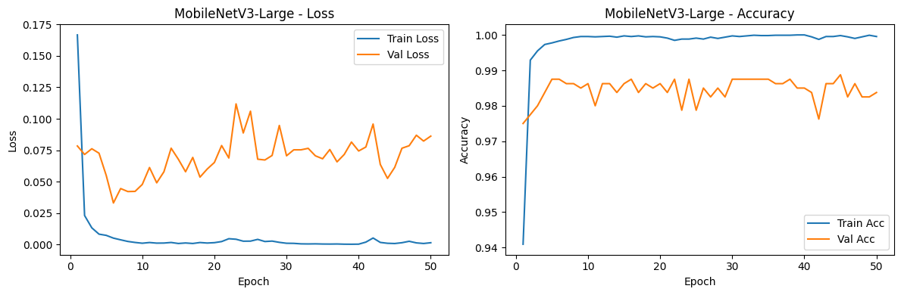

# 🌶️ Klasifikasi Penyakit Daun Cabai Menggunakan MobileNetV3

## 📖 Overview

Proyek ini merupakan sistem klasifikasi penyakit daun cabai berbasis Deep Learning menggunakan arsitektur MobileNetV3. Model dikembangkan untuk mengidentifikasi kondisi daun cabai secara otomatis berdasarkan citra digital.

Sistem mampu mengklasifikasikan daun cabai ke dalam empat kategori, yaitu Healthy, Leaf Curl, Leaf Spot, dan Yellowish Leaf. Model dibangun menggunakan TensorFlow dan diimplementasikan dalam bentuk aplikasi web menggunakan Flask sehingga pengguna dapat melakukan prediksi dengan mengunggah gambar daun cabai.

---

## 📂 Dataset

Dataset yang digunakan pada penelitian ini merupakan dataset citra daun cabai yang terdiri dari empat kelas, yaitu **Healthy**, **Leaf Curl**, **Leaf Spot**, dan **Yellowish Leaf**. Seluruh citra telah melalui tahap prapemrosesan dan dibagi menjadi data pelatihan, validasi, dan pengujian untuk memastikan model mampu melakukan generalisasi dengan baik.

### Kelas Dataset

| Kelas | Deskripsi |
|--------|-----------|
| Healthy | Daun cabai dalam kondisi sehat |
| Leaf Curl | Daun cabai yang mengalami penyakit keriting daun |
| Leaf Spot | Daun cabai yang mengalami penyakit bercak daun |
| Yellowish Leaf | Daun cabai yang mengalami perubahan warna menjadi kekuningan |

Datasetnya bisa diakses disini: https://app.roboflow.com/alfanz/daun-cabai-cz4fh/browse?queryText=&pageSize=50&startingIndex=0&browseQuery=true

## 🧠 Arsitektur Model

Model yang digunakan dalam proyek ini adalah **MobileNetV3**, yaitu salah satu arsitektur Convolutional Neural Network (CNN) yang dirancang untuk memberikan performa tinggi dengan jumlah parameter yang relatif kecil. Arsitektur ini sangat cocok untuk proses klasifikasi citra karena mampu menghasilkan akurasi yang baik dengan waktu inferensi yang cepat.

Pada proyek ini, MobileNetV3 digunakan sebagai model dasar (pre-trained) dengan bobot **ImageNet**, kemudian dilakukan proses *transfer learning* dan *fine-tuning* menggunakan dataset penyakit daun cabai.

## ⚙️ Konfigurasi Pelatihan

Model dilatih menggunakan TensorFlow dengan konfigurasi sebagai berikut.

| Parameter | Nilai |
|-----------|--------|
| Model | MobileNetV3 |
| Optimizer | SGD |
| Learning Rate | 0.01 |
| Batch Size | 32 |
| Epoch | 40 |
| Image Size | 224 × 224 |
| Loss Function | Categorical Crossentropy |
| Framework | TensorFlow |
| Platform | Google Colab (GPU Tesla T4) |

## 📊 Hasil Pelatihan

Hasil pelatihan menunjukkan bahwa model MobileNetV3 mampu mempelajari pola pada dataset dengan baik. Evaluasi dilakukan menggunakan grafik akurasi, grafik loss, serta confusion matrix.

### Hasil Training

### Confusion Matrix

