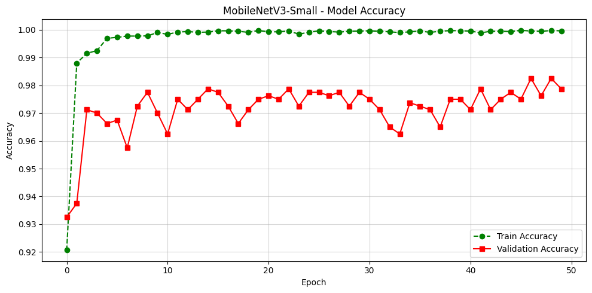
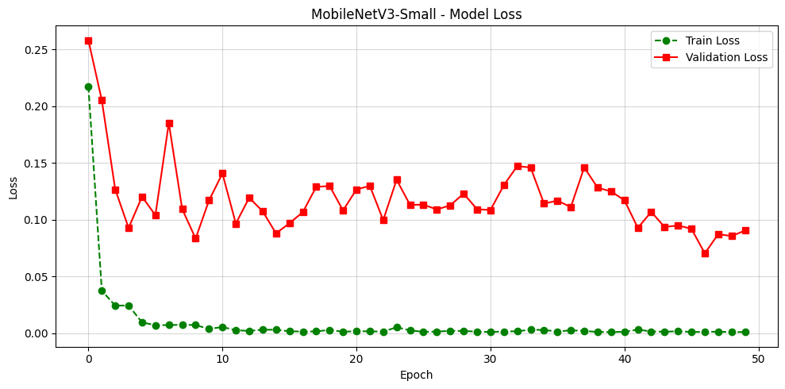
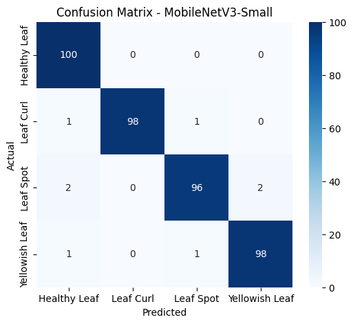
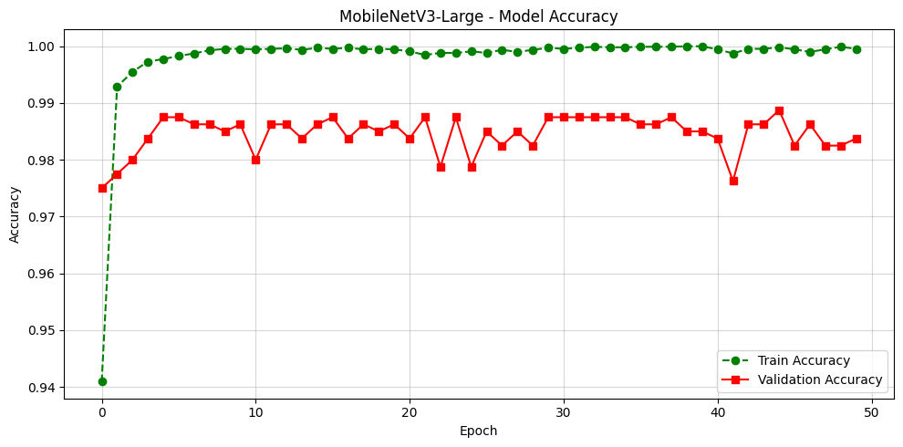
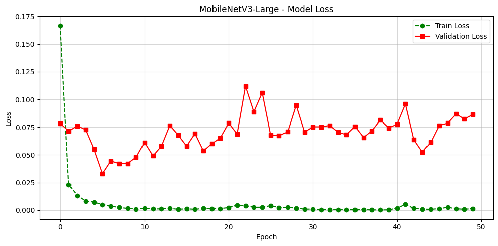
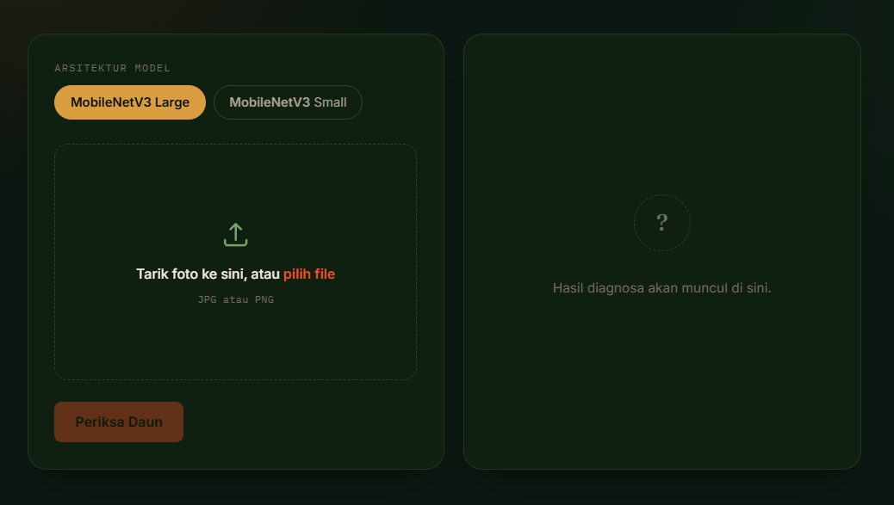
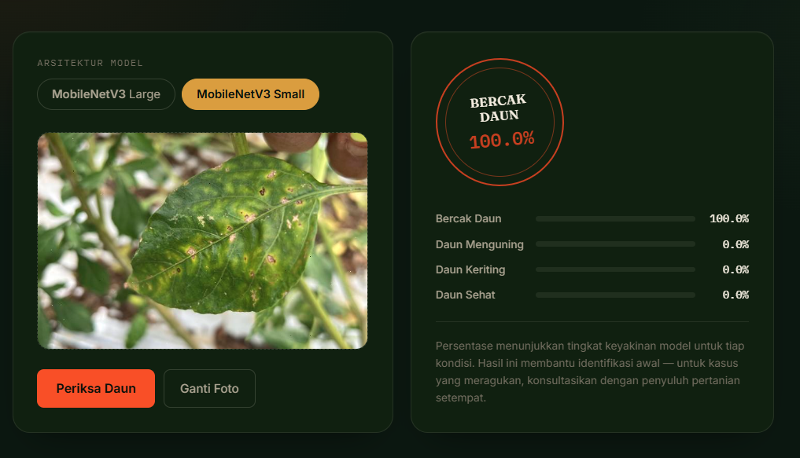

# 🌶️ Klasifikasi Penyakit Daun Cabai Menggunakan MobileNetV3

## 📖 Overview

Proyek ini merupakan sistem klasifikasi penyakit daun cabai berbasis Deep Learning menggunakan arsitektur MobileNetV3. Model dikembangkan untuk mengidentifikasi kondisi daun cabai secara otomatis berdasarkan citra digital.

Sistem mampu mengklasifikasikan daun cabai ke dalam empat kategori, yaitu Healthy, Leaf Curl, Leaf Spot, dan Yellowish Leaf. Model dibangun menggunakan TensorFlow dan diimplementasikan dalam bentuk aplikasi web menggunakan Flask sehingga pengguna dapat melakukan prediksi dengan mengunggah gambar daun cabai.

---

## 📂 Dataset

### 📌 Sumber Dataset

Dataset pada proyek ini dikompilasi secara mandiri dari berbagai sumber gambar yang tersedia di internet. Seluruh data kemudian dikumpulkan, diseleksi, disusun berdasarkan kelas, dan diproses untuk membentuk dataset klasifikasi penyakit daun cabai.
Link Dataset: https://universe.roboflow.com/alfanz/daun-cabai-cz4fh

Proses anotasi dan pengelolaan dataset dilakukan menggunakan Roboflow. Dataset terdiri dari empat kelas, yaitu **Healthy, Leaf Curl, Leaf Spot, dan Yellowish Leaf**.

Dataset yang digunakan dalam proyek ini merupakan dataset citra daun cabai yang terdiri dari empat kelas, yaitu **Healthy**, **Leaf Curl**, **Leaf Spot**, dan **Yellowish Leaf**.

Setiap kelas memiliki **1.000 citra**, sehingga total dataset yang digunakan berjumlah **4.000 citra**.

### Kelas Dataset

| Kelas | Jumlah Citra |
|---|---:|
| Healthy | 1.000 |
| Leaf Curl | 1.000 |
| Leaf Spot | 1.000 |
| Yellowish Leaf | 1.000 |
| **Total** | **4.000** |

### Pembagian Dataset

Dataset dibagi menjadi data **training**, **validation**, dan **testing** dengan rasio **70:20:10**.

| Dataset | Persentase | Jumlah |
|---|---:|---:|
| Training | 70% | 2.800 |
| Validation | 20% | 800 |
| Testing | 10% | 400 |
| **Total** | **100%** | **4.000** |

Pembagian tersebut diterapkan secara proporsional pada masing-masing kelas, sehingga setiap kelas memiliki 700 citra untuk training, 200 citra untuk validation, dan 100 citra untuk testing.

## 🧠 Arsitektur Model

Model yang digunakan dalam proyek ini adalah **MobileNetV3**, yaitu salah satu arsitektur Convolutional Neural Network (CNN) yang dirancang untuk memberikan performa tinggi dengan jumlah parameter yang relatif kecil. Arsitektur ini sangat cocok untuk proses klasifikasi citra karena mampu menghasilkan akurasi yang baik dengan waktu inferensi yang cepat.

Pada proyek ini, MobileNetV3 digunakan sebagai model dasar (pre-trained) dengan bobot **ImageNet**, kemudian dilakukan proses *transfer learning* dan *fine-tuning* menggunakan dataset penyakit daun cabai.

## ⚙️ Konfigurasi Pelatihan

Model dilatih menggunakan TensorFlow dengan konfigurasi sebagai berikut.

| Parameter | Nilai |
|-----------|--------|
| Model | MobileNetV3 |
| Optimizer | SGD |
| Learning Rate | 0.01 |
| Batch Size | 32 |
| Epoch | 40 |
| Image Size | 224 × 224 |
| Loss Function | Categorical Crossentropy |
| Framework | TensorFlow |
| Platform | Google Colab (GPU Tesla T4) |

## 📊 Hasil Pelatihan

Pelatihan dilakukan menggunakan dua varian arsitektur MobileNetV3, yaitu **MobileNetV3-Small** dan **MobileNetV3-Large**. Hasil pelatihan dievaluasi menggunakan grafik akurasi, grafik loss, dan confusion matrix untuk mengetahui kemampuan masing-masing model dalam mengklasifikasikan penyakit daun cabai.

### MobileNetV3-Small

#### 1. Grafik Akurasi

Grafik akurasi menunjukkan perubahan tingkat ketepatan model selama proses pelatihan pada data training dan validation.

Pada grafik terlihat bahwa **training accuracy** meningkat dari sekitar 92% pada awal pelatihan hingga mendekati 100%. Sementara itu, **validation accuracy** berada pada kisaran 96–98% dan tetap relatif stabil hingga akhir pelatihan. Perbedaan antara training accuracy dan validation accuracy menunjukkan adanya sedikit kecenderungan overfitting, tetapi model masih mampu mempertahankan performa yang baik pada data validation.

#### 2. Grafik Loss

Grafik loss menunjukkan perubahan nilai kesalahan model selama proses pelatihan. Semakin kecil nilai loss, semakin baik kemampuan model dalam mempelajari pola pada data.

Training loss mengalami penurunan yang sangat signifikan dari sekitar 0,22 pada awal pelatihan hingga mendekati 0. Validation loss juga mengalami penurunan secara keseluruhan, meskipun terdapat beberapa fluktuasi selama proses pelatihan. Pada akhir pelatihan, validation loss berada di sekitar 0,09.

Perbedaan antara training loss yang mendekati 0 dan validation loss yang masih lebih tinggi menunjukkan adanya sedikit indikasi overfitting, namun validation loss tetap berada pada nilai yang relatif rendah.

#### 3. Confusion Matrix

Confusion matrix digunakan untuk melihat kemampuan model dalam membedakan masing-masing kelas pada data pengujian. Nilai pada diagonal menunjukkan jumlah prediksi yang benar, sedangkan nilai di luar diagonal menunjukkan kesalahan klasifikasi.

Pada data pengujian sebanyak **400 citra**, model berhasil mengklasifikasikan **392 citra dengan benar**, sehingga memperoleh akurasi sebesar **98%**.

| Kelas | Prediksi Benar | Kesalahan |
|---|---:|---:|
| Healthy Leaf | 100/100 | 0 |
| Leaf Curl | 98/100 | 2 |
| Leaf Spot | 96/100 | 4 |
| Yellowish Leaf | 98/100 | 2 |

Kelas **Healthy Leaf** memiliki hasil terbaik karena seluruh 100 citra berhasil diklasifikasikan dengan benar. Kesalahan klasifikasi terbanyak terjadi pada **Leaf Spot**, dengan 4 citra yang salah diklasifikasikan.

---

### MobileNetV3-Large

#### 1. Grafik Akurasi

Grafik akurasi menunjukkan perubahan tingkat ketepatan model selama proses pelatihan pada data training dan validation.

Pada grafik terlihat bahwa **training accuracy** meningkat dari sekitar 94,1% pada awal pelatihan hingga mendekati 100%. Sementara itu, **validation accuracy** berada pada kisaran 97,5–98,9% dan tetap relatif stabil hingga akhir pelatihan. Perbedaan antara training accuracy dan validation accuracy menunjukkan adanya sedikit kecenderungan overfitting, tetapi model masih mampu mempertahankan performa yang baik pada data validation.

#### 2. Grafik Loss

Grafik loss menunjukkan perubahan nilai kesalahan model selama proses pelatihan. Semakin kecil nilai loss, semakin baik kemampuan model dalam mempelajari pola pada data.

Training loss mengalami penurunan yang sangat signifikan dari sekitar 0,166 pada awal pelatihan hingga mendekati 0. Validation loss juga mengalami penurunan secara keseluruhan, meskipun terdapat beberapa fluktuasi selama proses pelatihan. Pada akhir pelatihan, validation loss berada di sekitar 0,087.

Perbedaan antara training loss yang mendekati 0 dan validation loss yang masih lebih tinggi menunjukkan adanya sedikit indikasi overfitting, namun validation loss tetap berada pada nilai yang relatif rendah.

#### 3. Confusion Matrix

Confusion matrix digunakan untuk melihat kemampuan model dalam membedakan masing-masing kelas pada data pengujian. Nilai pada diagonal menunjukkan jumlah prediksi yang benar, sedangkan nilai di luar diagonal menunjukkan kesalahan klasifikasi.

Pada data pengujian sebanyak **400 citra**, model berhasil mengklasifikasikan **398 citra dengan benar**, sehingga diperoleh akurasi sebesar **99,5%**.

| Kelas | Prediksi Benar | Kesalahan |
|---|---:|---:|
| Healthy Leaf | 100/100 | 0 |
| Leaf Curl | 99/100 | 1 |
| Leaf Spot | 100/100 | 0 |
| Yellowish Leaf | 99/100 | 1 |

Kelas **Healthy Leaf** dan **Leaf Spot** memiliki hasil terbaik karena seluruh 100 citra berhasil diklasifikasikan dengan benar. Kesalahan klasifikasi hanya terjadi pada **Leaf Curl** dan **Yellowish Leaf**, masing-masing sebanyak 1 citra.

## 🌐 Tampilan Aplikasi Web

Aplikasi ini dikembangkan menggunakan **Flask** sebagai antarmuka berbasis web. Pengguna dapat mengunggah gambar daun cabai, kemudian sistem akan melakukan klasifikasi menggunakan model MobileNetV3 dan menampilkan hasil prediksi secara otomatis.

### 1. Halaman Utama

Halaman awal aplikasi yang menampilkan informasi singkat mengenai sistem serta tombol untuk memulai proses klasifikasi.

### 2. Halaman Upload Gambar

Pengguna dapat mengunggah gambar daun cabai yang akan diproses oleh model.

### 3. Halaman Hasil Prediksi

Setelah gambar diproses, sistem akan menampilkan hasil klasifikasi beserta tingkat kepercayaan (confidence).

